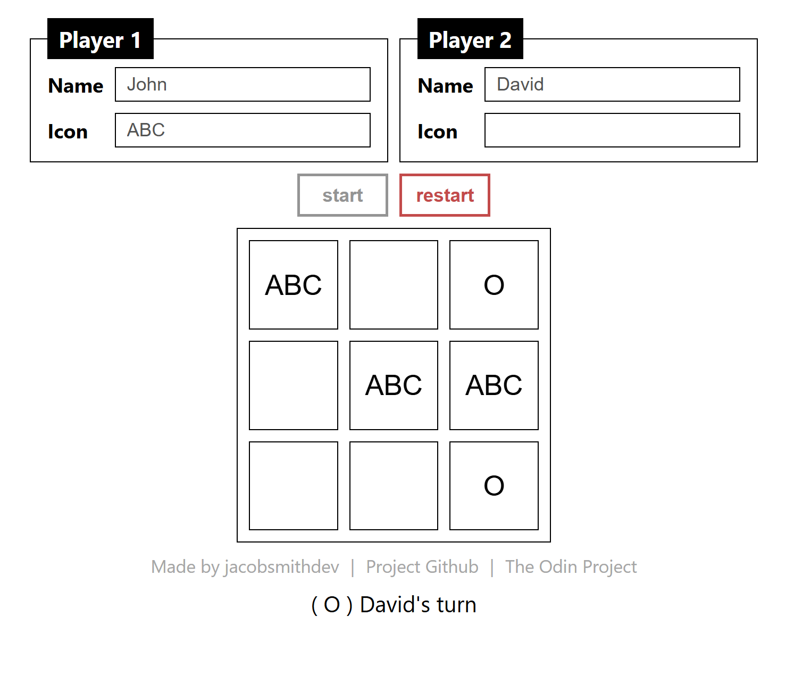

# Tic-Tac-Toe (for The Odin Project)
My tic-tac-toe game, made for The Odin Project. 

## Live Preview
See a [live preview](https://jsmith-code.github.io/tic-tac-toe-top/).

## Features
 - Displays and inputs enable/disable based on game state
 - Option to choose a name
 - Option to choose a playable text icon instead of an 'X' or 'O' (icon can only be 3 characters long)

## Built with
 - HTML
 - CSS
 - Javascript

## References
 - [The Odin Project's lesson](https://www.theodinproject.com/lessons/node-path-javascript-tic-tac-toe)
 - [BEM - CSS Naming convention](https://getbem.com/introduction/)